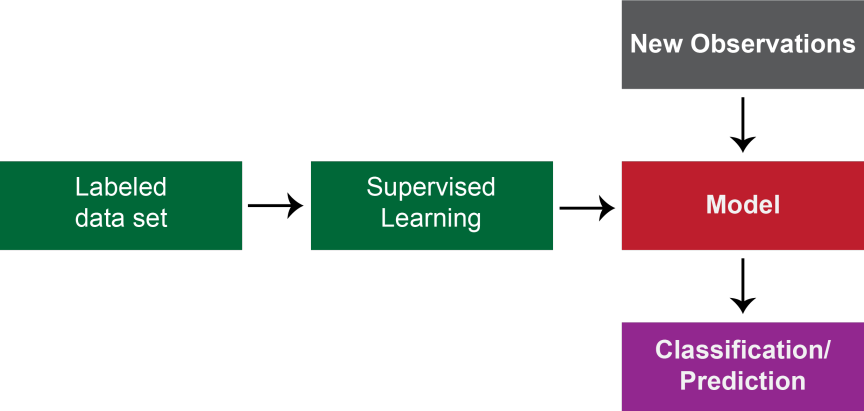

# Introduction to Machine Learning

<!--more-->

I started taking a few online classes to get myself familiarized with machine learning. In this series of blog posts 
I will try to organize and summarize everything I learnt. This is the first of many tutorials that will get you 
started on machine learning using python. 

### **What is Machine learning?**

*Machine learning* is a branch of artificial intelligence that is based on the notion that systems can learn from data, 
identify patterns and make predictions/decisions with minimal human intervention.

### **Machine learning classification**

There are **four** basic types:

1. Supervised learning
2. Unsupervised learning
3. Semi-supervised learning
4. Reinforcement learning

The final choice of the approach depends on what type of data you are dealing with. In general these approaches contain 
three core components: *representation*, *evaluation*, and *optimization* (most relevant for supervised learning). 
Let's understand what each of these approaches mean.

### **1. Supervised learning**

In this method, a data scientist supplies an algorithm with labeled training data, define variables to assess for 
correlations and matching output values. In other words, a data scientist teach a machine using examples. While 
learning, the machine identifies patterns in data and then makes predictions. As you can see, the model building portion 
involves significant work and hence called *supervised learning*. This is the most frequently used form of machine 
learning and is great for *regression modeling* (to predict continuous values), *binary or multi-class classification* 
(to divide data into two classes or choose between >2 answers) and *ensembling* (to combine multiple ML predictions to 
generate an accurate prediction).

**Supervised learning methods**

There are many complex supervised learning algorithms. However, they all are broadly divided into two main classes:

1. **Classification:** These models are used when the output variable can be categorized (*i.e.,* Yes/No, Pass/Fail, benign/malignant/normal, *etc.*).
2. **Regression:** These models are used when the output variable is a real value, hence can be used to *predict* or *forecast* a numeric value based on previous observations.

The following table shows most frequently used algorithms in each of these classes:

| Classification                 | Regression                       |
| ------------------------------ | -------------------------------- |
| Logistic regression            | Linear regression                |
| k-Nearest Neighbors (kNN)      | Polynomial regression            |
| Support Vector Machines (SVM)  | Support Vector Regression (SVR)  |
| Naive-Bayes                    | Decision tree regression         |
| Decision tree classification   | Random forest regression         |
| Random forest classification   |                                  |

### **2. Unsupervised learning**

As the name implies, this mode of machine learning does not require data to be pre-labeled. Algorithms in this class 
can sift through data to identify patterns that then can be used to categorize data into different classes. These 
learning methods are great choices for *clustering* (to split data into groups based on similarity), 
*anomaly detection* (to identify odd data points in a data set), *association mining* (to identify sets of items in a 
data set that frequently occur together), and *dimension reduction* (to reduce the number of variables in a data set).

**Unsupervised learning methods**

There are many complex unsupervised learning algorithms and they can be broadly divided into few classes as below:

1. **Clustering:** This is a data mining technique which groups unlabeled data into groups based on how similar or 
different they are to one another.
2. **Association rules:** An association rule is a rule-based method for identifying relationships between variables in 
a given data set. Have you ever wondered how businesses decide a pair of products for an offer like "buy one get one 
50% off"? This is a great example of association rule learning.
3. **Dimensionality reduction:** This is a technique used when the number of features, or dimensions, in a given data 
set is too high. It reduces the number of data inputs to a manageable size without compromising the integrity of the 
data set.

Following table shows most frequently used algorithms in each of these classes:

| Clustering               | Association rule learning | Dimension reduction                |
| ------------------------ | ------------------------- | ---------------------------------- |
| K-means clustering       | Apriori algorithm         | Principal component analysis (PCA) |
| Hierarchical clustering  | Eclat algorithm           | Singular value decomposition (SVD) |
| Probabilistic clustering |                           | Autoencoders                       |

### **3. Semi-supervised learning**

This machine learning method combines features of supervised and unsupervised learning. In this method, the model is 
built using both labelled and unlabelled data. In many applications, annotating data is cumbersome. In this method, the 
algorithm first use labelled data to understand dimensions and accordingly learn to label unlabelled data. As you may 
imagine, semi-supervised learning strikes a middle ground between the performance of supervised learning and the 
efficiency of unsupervised learning. Few areas that benefits from these methods include machine translation, fraud 
detection and labelling data.

### **4. Reinforcement learning**

This learning method is often used for robotics, gaming and navigation. With reinforcement learning, the algorithm 
discovers through trial and error which actions yield the greatest rewards. There are three primary components of 
reinforcement learning: the agent (the learner or decision maker), the environment (everything the agent interacts 
with) and actions (what the agent can do). The objective is for the agent to choose actions that maximize the expected 
reward over a given amount of time. In other words, the agent seeks positive rewards, which it receives when it 
performs an action that is beneficial toward the ultimate goal and avoids punishments, which it receives when it 
performs an action that is gets away from the ultimate goal. The agent will reach the goal much faster by following a 
good policy. So the goal in reinforcement learning is to learn the best policy.

This concludes the first machine learning tutorial. In the next tutorial let's dive into learn the steps involved in 
machine learning. Please leave a comment below if you have any questions/comments.
