# Data Pre-Processing


<!--more-->

> The final performance of a machine learning model largely depends on the data that is being used to train the model. 
Therefore, data pre-processing can be considered as one of the most important steps in machine learning. Proper data 
pre-processing can convert a poorly performing model to an excellent model. In general, machine learning data 
pre-processing involves few fundamental steps. Depending on input data and the model that is building you may drop 
some of these steps. Now, let's review what these steps are and how to perform them using Python.

### Steps of data pre-processing

1. Importing and exploring the data set
2. Create matrix of features and dependent variable vector
3. Taking care of missing/NULL/NaN data
4. Encoding categorical data
5. Splitting the data set into training and test data
6. Feature scaling


To go through these steps, I downloaded one of the most popular data sets from Kaggle (please see 
[here](https://www.kaggle.com/fedesoriano/heart-failure-prediction) for a detailed description about the data set) and 
modified it a little bit to highlight these steps. The modified data set can be found 
[here](https://github.com/jkkbuddika/Datasets_ML/blob/main/heart.csv).


### 1. Importing and exploring the data set

First step of data pre-processing is importing the data set using Pandas to create a pandas data frame. The following 
code snippet will do just that and display the first five rows of the data frame.


```
import pandas as pd
dataset = pd.read_csv('https://raw.githubusercontent.com/jkkbuddika/Datasets_ML/main/heart.csv')
```



```
dataset.head()
```
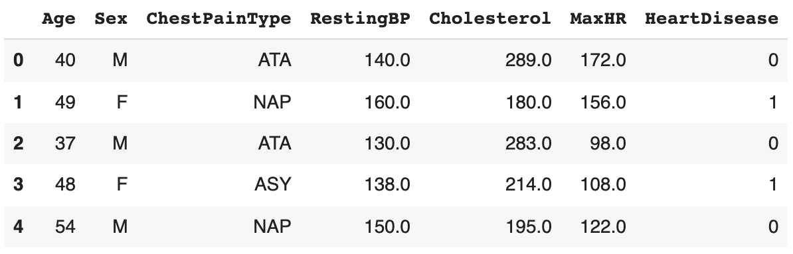


As you can see, the data set contains a total of seven columns, two of which are categorical. The last column, 
*HeartDisease*, indicates whether each patient (each row) has gotten cardiovascular disease (CVD) or not. Because 
there are columns with categorical data we have to encode this data prior to training a model. It is also not a bad 
idea to quickly assess descriptive statistics of the data set. Pandas makes this easy. Depending on the data set, this 
step alone can provide so much details. As you can see below, some of the numeric variables need to be scaled to 
ensure optimal performance of the final model.


```
dataset.describe()
```
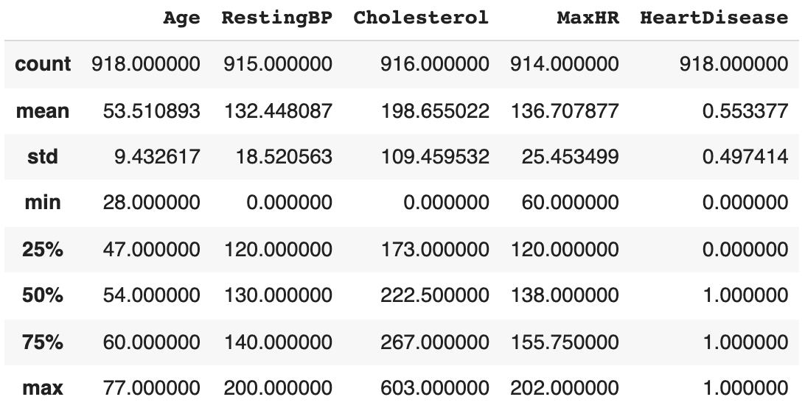


Although it is not required, I like to visualize data. Visualizations some times can tell you things that numbers 
cannot. There are many ways of doing this and different visualizations will tell different stories about your data set. 
For instance, plotting the *Sex* column will show the distribution of sex ratio in the data set, and plotting the *Age* 
column will reveal the age distribution. **Seaborn** is a great data visualization library for this. This is a library 
that is written on top of the popular matplotlib library (see [here](https://seaborn.pydata.org/index.html) for more 
details).


```
import seaborn as sns
import matplotlib.pyplot as plt
sns.countplot(data=dataset, x='Sex', palette='Dark2')
plt.show()
```
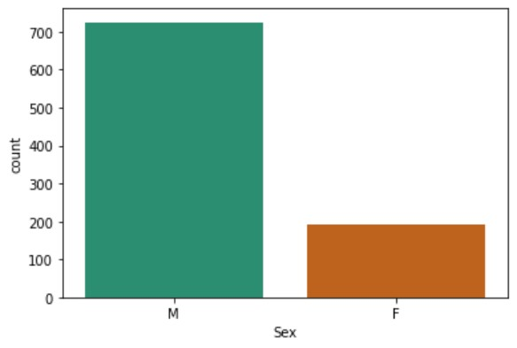



```
sns.displot(data=dataset, x='Age', kde=True, color='#960018')
plt.show()
```
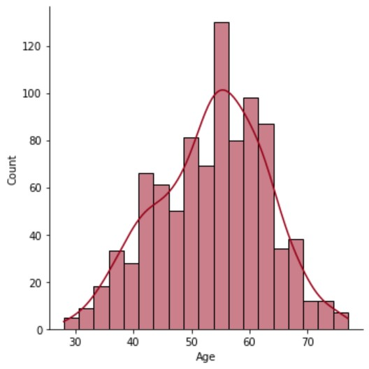


One of the most important steps in data pre-processing is taking care of missing values. This step is needed only when 
your data set contains columns with missing values. We can easily get this information. As you can see below, this 
modified data set contains three columns with missing values. Therefore, we will have to take care of them before 
training a model with this data.


```
dataset.isnull().sum()
```
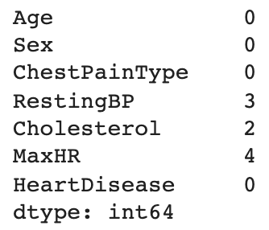


>I am not going to go through all exploratory analyses you can perform. Here are few important conclusions drawn from 
this initial analysis:
> - The data set contain categorical data and needs to be encoded.
> - Numeric variables need to be scaled to ensure optimal model performance.
> - There are columns with missing data need to be taken care of.

### 2. Create matrix of features and dependent variable vector

The next step after data import and assessment is separating data into **independent** and **dependent** variable 
vectors. Simply put, the **independent variable vector** (aka **feature vector** or the **matrix of features**) is the 
cause and the **dependent variable vector** represents the effect. The value of the dependent variable is determined 
by the value(s) of independent variable(s). In general, I reorganize the input data frame so that the last column of 
the data frame represents the dependent variable and independent variables are arranged to the left of this. In case 
if you do not know how to do this, please refer to this stackoverflow 
[thread](https://stackoverflow.com/questions/13148429/how-to-change-the-order-of-dataframe-columns). In our example 
data set, the dependent variable *HeartDisease* is in the last column. Therefore, we do not have to worry about this. 


```
X = dataset.iloc[:, :-1].values
y = dataset.iloc[:, -1].values
```



```
print(X)
```
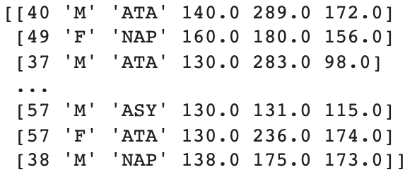



```
print(y)
```
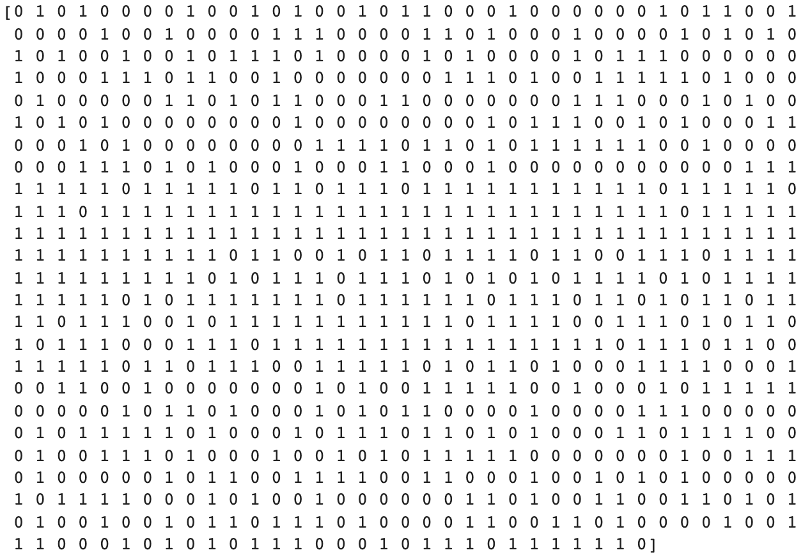


### 3. Taking care of missing/NULL/NaN data

Now that we have separated our data set into independent and dependent variables, it is time to move on to next steps. 
As I mentioned above, the modified data set we use had missing values in *RestingBP*, *Cholesterol*, and *MaxHR* 
columns. We need to take care of these before moving on to next steps. Note that you can do this step before step 
2 above. There are few ways you can handle missing data (please note that this is not an exhaustive list):

1. Remove rows/columns with missing values
2. Try predicting missing values
3. Assign the mean/median/mode value to missing values

Of these methods, the simplest is to remove rows/columns with missing values. We can use the `dropna` function 
(`axis=0` to drop *rows* or `axis=1` to drop *columns* with missing values) of Pandas to achieve this. You have to be 
cautious here as you may unnecessarily lose too much data. 

An effective way of taking care of missing data is assigning a value to missing data. You can use for instance, a 
linear regression or KNN model to predict missing values. This is out of scope for this particular blog post. 
Alternatively, missing data can be filled with the value of mean, median (for numerical values) or mode (for 
categorical values) depending on the data type. One of my favorite ways to do this is to use the `SimpleImputer` 
class of `sklearn.impute` module. You can simply pass the `strategy` argument specifying the replacement strategy: 
mean, median or mode. In our data set, all columns with missing data contain numerical values, therefore, let's use 
mean to replace missing values.


```
from sklearn.impute import SimpleImputer
import numpy as np

imputer = SimpleImputer(missing_values=np.nan, strategy='mean')
imputer.fit(X[:, 3:5])
X[:, 3:5] = imputer.transform(X[:, 3:5])
```



If you want to read more about handling missing data, refer to this detailed blog 
[post](https://towardsdatascience.com/7-ways-to-handle-missing-values-in-machine-learning-1a6326adf79e) on medium.


### 4. Encoding categorical data

If the input data set contains categorical data, we have to take care of them before training a machine learning 
model. Categorical data is simply information aggregated into groups rather than being in numeric formats (*i.e.,* 
Sex and ChestPainType from our example data set). Categorical data present in almost all real-life data sets (in both 
independent and dependent variables), however, current algorithms still struggle to deal with them (*i.e.,* trying to 
train a model without encoding categorical data will immediately output an error). There are two types of categorical 
data:

1. **Ordinal data:** Categories have an inherent order
2. **Nominal data:** Categories do not have an inherent order

Likewise, there are many approaches to encode these categorical data. Two very frequently used approaches are:

1. **Label/Ordinal encoding:** For ordinal categorical features. Each label is converted into an integer value.
2. **One-hot encoding:** For nominal data. This method works by creating binary vectors for each category in a 
categorical variable. For instance, if the categorical variable contains 3 categories, 3 binary variables are created.

Let's employ label encoding for *Sex* and one-hot encoding for *ChestPainType*, so that we can see how each can be 
done. We can use the `sklearn.preprocessing` module for both of these. I encourage you to use the `shape` attribute and 
track the shape of the array as you go through encoding steps below. See what you find.


```
print(X)
```
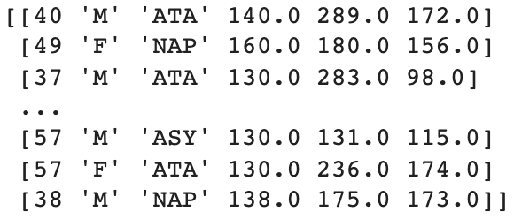



```
from sklearn.preprocessing import LabelEncoder
le = LabelEncoder()
X[:, 1] = le.fit_transform(X[:, 1])
```



```
print(X)
```
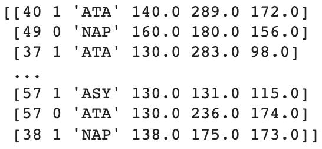



```
from sklearn.compose import ColumnTransformer
from sklearn.preprocessing import OneHotEncoder
ct = ColumnTransformer(transformers=[('encoder', OneHotEncoder(), [2])], remainder='passthrough')
X = np.array(ct.fit_transform(X))
```



```
print(X)
```
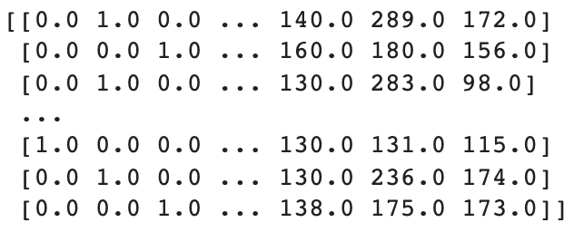



If you want to read more about other available approaches, please refer to this blog 
[post](https://analyticsindiamag.com/a-complete-guide-to-categorical-data-encoding/).


### 5. Splitting the data set into training and test data

At this point, we have handled missing values and have successfully encoded categorical variables. The next step of 
pre-processing is splitting the data set into training and test data. The technique, **train-test split** is used to 
evaluate the performance of a machine learning algorithm. This is an essential pre-processing step when you are 
dealing with classification and regression problems. This is a very simple step and involves taking a data set and 
dividing it into two subsets:

1. **Training data set:** Used to fit the model
2. **Test data set:** Used to evaluate the performance of the model

Given that the splitting had been done prior to training the model, we can use the test data at the end to let the 
model do predictions and compare these predictions to real values. In theory this is what we eventually want to do with 
the trained model isn't it? Use the model on new data and make predictions. *Note that this procedure is appropriate 
when the input data set is sufficiently large*. In instances where there's no enough input data, model performance can 
be evaluated using an approach like *K-fold cross validation*.

There is no optimal split. The final split percentage must be chosen based on the objectives of the project. Most 
commonly used percentages include 80:20 or 67:33 training to test split. An important point to make here is that we 
perform train-test splitting prior to feature scaling, which is the next step of data pre-processing. This is simply to 
avoid information leakage. In other words, if we perform feature scaling prior to splitting we influence test data with 
training data. This can make a poorly performing model look like a good one. We can use the `train_test_split` class 
of the `sklearn.model_selection` module to get this job done. In this example, let's perform a 80:20 split. See below.


```
from sklearn.model_selection import train_test_split
X_train, X_test, y_train, y_test = train_test_split(X, y, test_size = 0.2, random_state = 1)
```


### 6. Feature scaling

The last step of data pre-processing is *feature scaling* and is a crucial step of data pre-processing. In many 
instances, input data we use for training a model contain numeric variables/features that spans varying degrees of 
magnitude, range and units. Although some of the algorithms are not sensitive to these discrepancies (*i.e.,* 
tree-based methods), many are very sensitive to this (*i.e.,* gradient descent-based and distance-based algorithms). 
Therefore, knowing how to handle this issue is important. There are two common approaches for feature scaling:

1. **Normalization:** Also know as *min-max scaling*, this technique shifts and rescale values so that they end up 
ranging between 0 and 1. This is a good approach to be used when the values do not follow a Gaussian distribution and 
often used when training KNNs and neural networks. We can use the `MinMaxScalar` class of the `sklearn.preprocessing` 
module to perform normalization.

2. **Standardization:** In this technique, values are centered around the mean with a unit standard deviation. In other 
words, the mean of the attributes become zero and the final resulting distribution has a unit standard deviation. This 
method is used when the values follow a Gaussian distribution (not required to be true). We can use the 
`StandardScaler` class of the `sklearn.preprocessing` module to get this task done.

It is always a good idea to train the model following both of these scaling methods and assess which method results in 
a better performing model. I will let you to try and do normalization. Let's use standardization to scale our data. 
During scaling you have the option to include or exclude encoded data. This may or may not affect the overall 
performance of the final model. In this example I will scale everything. Try without scaling encoded data as well.


```
print(X)
```
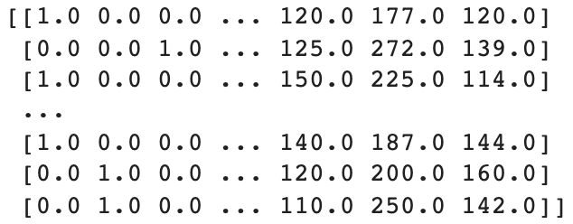



```
from sklearn.preprocessing import StandardScaler
sc = StandardScaler()
X_train[:, :] = sc.fit_transform(X_train[:, :])
X_test[:, :] = sc.transform(X_test[:, :])
```



```
print(X)
```
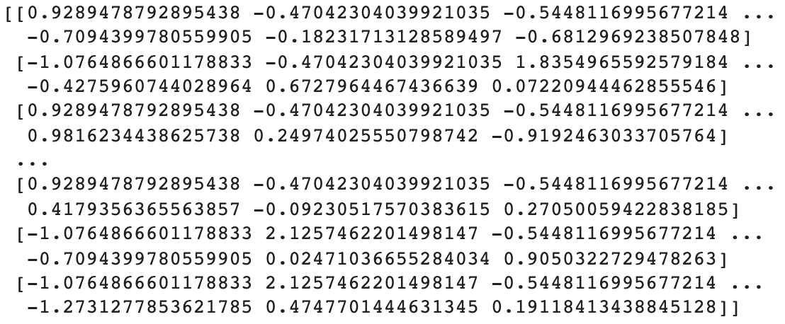


This concludes the data pre-processing phase. In general, data scientists spend most of their time performing these 
steps. I wanted to give you a clear step-wise guide to summarize all you want to know before getting into training a 
model. Please note that depending on the problem you are addressing and the nature of your data set, you will have to 
make alterations to this general scheme. As you have seen, there are multiple ways of achieving the same final goal. 
I strongly advise trying many possible combinations and figure out the best set of steps that provide you with a 
model that performs well.


You can access the Google Colaboratory notebook of this blog post by clicking 
[here](https://colab.research.google.com/drive/1Yk3dF_JMevNZCoBUub_xE2XC_HHl2_Iq#scrollTo=h7dhhT1kDXaM).

